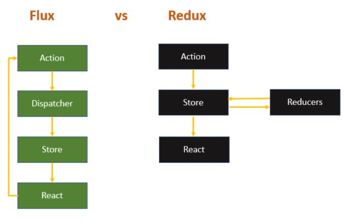

<p align="center">
  <a href="https://github.com/he4rt/4noobs" target="_blank">
    
  </a>
</p>

# Redux

"Redux é um "container" de estado previsível para aplicativos JavaScript.

Ele ajuda a escrever aplicativos que se comportam de forma consistente, pode ser executado em ambientes diferentes (cliente, servidor e nativo) e fáceis de testar. Além disso, ele fornece uma ótima experiência para o desenvolvedor, como edição de código em tempo real combinado com um depurador em tempo de execução.

Você pode usar o Redux junto com o React ou com qualquer outra biblioteca/Framework Front-end. É compacto (2kB, incluindo dependências), mas tem um grande ecossistema de "add-ons" (componente de software que adiciona novas funcionalidades ou características) disponíveis." - definição traduzida do site https://redux.js.org/introduction/getting-started

## O que é o Flux?

Primeiramente precisamos entender como funciona a arquitetura do Redux, no caso entender primero o que é a arquitetura Flux.

Flux é uma arquitetura criada pelo Facebook como solução alternativa ao padrões de arquitetura usuais como por exemplo MVC, para solucionar problemas de controle de estados, na época um problema constante do Facebook era as notificações que não atualizavam o seu estado de forma correta.

Essa arquitetura tem como conceito o princípio do fluxo unidirecional tendo 4 (quatro) estados Action, Dispatcher, Store e View, dessa forma o usuário provoca algum evento que gera uma "Action" especifica, essa "Action" vai acionar um "Dispatcher" que comunica ao "Store" a necessecidade de mudar algum dado e por fim envia um evento para que seja mostrado na "View" a alteração realizada. veja abaixo no diagrama uma vizualização da arquitetura:

 - créditos: https://facebook.github.io/flux/docs/in-depth-overview/

Perceba também que nessa estrutura a View também podem gerar novas "Actions" para os "Dispatchers" e retornar o fluxo do ínicio, veja abaixo no diagrama essa interação:

 - créditos: https://facebook.github.io/flux/docs/in-depth-overview/

Apenas vou fazer algumas observações sobre características do Flux, os estados da aplicação são mutáveis, possuí apenas um único "Dispatcher" e possuí multiplos "Store".

## Como Funciona o Redux

Agora que entendemos a arquitetura do Flux, vamos entender como funciona o Redux, que é baseado no Flux, mas não é completamente igual a ele. Primeiro de tudo temos a "Action", "Reducers", "Store" e "React", essa é a estrutura do Redux, nela já observamos que temos de igual algumas coisa e outras não.

No geral tudo funciona bem parecido mas existem diferenças importantes, os "Reducers" são equivalente ao "Dispatcher" com uma diferença não existe um único "Reducers" e sim pode haver 1 (um) ou mais deles, a "Store" é igual com a diferença que só existe uma em vez de várias "Stores", o "React" é igual a "View" mas como estamos aplicando em React ela tem esse nome, e as "Actions" possuem a mesma função e da mesma forma que no Flux. Abaixo temos um diagrama comparando o funcionamento do Flux com o Redux:

 - créditos: https://facebook.github.io/flux/docs/in-depth-overview/

## Como usar o Redux no React

Primeiramente para instalar os pacotes do Redux na sua aplicação React, use os seguintes comandos:
  - npm install redux
  - npm install react-redux
  - npm install --save-dev redux-devtools

### Action

Agora vamos entender como a estrutura funciona no código em si, começando pelas "Actions", elas basicamente vão ser as informações de estado que a aplicação vai enviar para o "Store" através dos "Reducers".

Nesse primeiro código vemos um exemplo de um "Action Creator", ele basicamente é um objeto que passara os nomes de estados a ser informado para a "Store".

```jsx
export const ActionsTypes = {
    SET_PRODUCTS: "SET_PRODUCTS",
    SELECTED_PRODUCTS: "SELECTED_PRODUCTS",
    REMOVE_SELECTED_PRODUCTS: "REMOVE_SELECTED_PRODUCTS",
};
```

Nesse código agora estou exportando minhas "Actions", que irão usar as "Action Creator" criadas anteriormente, para enfim passar os valores de estado da aplicação.

```jsx
import { ActionsTypes } from "../contants/action-types";

export const setProducts = (products) => {
    return {
        type: ActionsTypes.SET_PRODUCTS,
        payload: products,
    }
}

export const selectedProducts = (products) => {
    return {
        type: ActionsTypes.SELECTED_PRODUCTS,
        payload: products,
    }
}

export const removeSelectedProducts = () => {
    return {
        type: ActionsTypes.REMOVE_SELECTED_PRODUCTS,
    }
}
```

Agora veja no código a seguir como usar as "Actions" criadas para avisar ao "Reducers" que houve alguma mudança e é necessário avisar ao "Store".

```JSX
import React, { useEffect } from 'react';
import { useSelector, useDispatch } from 'react-redux';
import axios from 'axios';
import ProductComponent from './ProductComponent';
import { setProducts } from '../redux/actions/productActions';

const ProductListing = () => {

    const products = useSelector((state) => state);
    const dispatch = useDispatch();

    const fetchProducts = async () => {
        const response = await axios
            .get("https://fakestoreapi.com/products")
            .catch((err) => {
                console.log("error: ", err);
            });
        dispatch(setProducts(response.data));
    };

    useEffect(() => {
        fetchProducts()
    }, []);

    return(
        <div className="ui grid container">
            <ProductComponent />
        </div>
    );
}

export default ProductListing;
```

 Veja que crio uma constante "dispatch" para receber a função "useDispatch()" Dentro da constante "fetchProducts" crio uma "Arrow Function" e nela quando faço uma requisição a API passo o argumento a "dispatch" como "setProducts(response.data)", para assim avisar a necessidade de mundança no estado da aplicação e como argumento da função passo os dados retornados de minha API, onde serão armazenadas no "payload" de "setProducts()".

 Uma observação para quem ficou confuso sobre o nome da função "useDispatch()", foi mantido a referência ao nome "Dispatcher" por convenção do próprio pessoal do Facebook, os mesmos acharam melhor manter a referência apesar da biblioteca do Redux em sua estrutura não usar "Dispatcher" e sim "Reducers".

### Reducers

Os "Reducers" são funções puras, ou seja a mesma entrada da função também será o seu retorno, isso porque os "Reducers" tem a função de enviar uma chamada para o "Store" enfim verificar a mudança de estado, e então poder realizar a mudança.

Nesse próximo código vamos ver a estrutura que um "Reducer" possui.

```JSX
import { ActionsTypes } from '../contants/action-types';

const initialState = {
    products: [],
};

export const productReducer = (state = initialState, { type, payload }) => {
    switch (type) {
        case ActionsTypes.SET_PRODUCTS:
            return {...state, products: payload};
        default:
            return state;
    }
};

export const selectedProductReducer = (state = {}, { type, payload }) => {
    switch (type) {
        case ActionsTypes.SELECTED_PRODUCTS:
            return {...state, ...payload};
        case ActionsTypes.REMOVE_SELECTED_PRODUCTS:
            return {};
        default:
            return state;
    }
}
```
Veja que no "Reducer" acima o estado da aplicação inicial é vazio, e após alguma solicitação ou mudança de estado disparado pelos "Actions" por causa de alguma interação, as funções "Reducers" verificam a mudança e repassam para o "Store".

No código a seguir, apenas estou copilando os reducers usando o "combineReducers()", para exportar em uma única constante "reducers" e deixar os nomes das funções mais semântico.

```JSX
import { combineReducers } from 'redux';
import { productReducer, selectedProductReducer } from './productReducer';

const reducers = combineReducers({
    allProducts: productReducer,
    product: selectedProductReducer,
});


export default reducers;
```

Neste próximo código será mostrado como se faz o uso do "Reducer", onde na constante "products" foi usado o Hook do Redux "useSelector()", e passamos como argumento uma "Arrow Function" e como argumento tenho o "state" que seria o estado atual do elemento, onde basicamente aplico meu "Reducer" e passo a propriedade "products". Sendo assim, o valor inicial era vazio, mas após a API enviar os dados e o "Reducer" verificar a alteração de estado, o mesmo informara ao "Store" para mudar seu estado e acrescentar as informações ao Componente.

```JSX
import React from 'react';
import { Link } from 'react-router-dom';
import { useSelector } from 'react-redux';

const ProductComponent = () => {

    const products = useSelector((state) => state.allProducts.products);
    const renderList = products.map((product) => {
        const {id, title, image, price, category} = product;

        return(
            <div className="four wide column" key={id}>
                <Link to={`/product/${id}`}>
                    <div className="ui link cards">
                        <div className="card">
                            <div className="image">
                                
                            </div>
                            <div className="content">
                                <div className="header">{ title }</div>
                                <div className="meta price">$ { price }</div>
                                <div className="meta">{ category }</div>
                            </div>
                        </div>
                    </div>
                </Link>
            </div>
        );
    });

    return <>{renderList}</>;
}

export default ProductComponent;
```

De forma análoga acontece neste código abaixo também, mas ao invés de verificar o estado de mudança de todos os items retornados, agora ele verifica o estado de um único item selecionado.

```JSX
import React, { useEffect } from "react";
import axios from "axios";
import { useParams } from "react-router-dom";
import { useDispatch, useSelector } from "react-redux";
import { selectedProducts, removeSelectedProducts } from "../redux/actions/productActions";

const ProductDetail = () => {
    const product = useSelector((state) => state.product)
    const {image, title, price, category, description} = product;
    const { productId } = useParams();
    const dispatch = useDispatch();

    const fetchProductDetail = async () => {
        const response = await axios.get(`https://fakestoreapi.com/products/${productId}`)
            .catch(err => {
                console.error("Error: ", err);
            })
        dispatch(selectedProducts(response.data));
    };

    useEffect(() => {
        if(productId && productId !== "")
        {
            fetchProductDetail();
        }

        return () => {
          dispatch(removeSelectedProducts());
        }
    }, [productId]);

    return (
        <div className="ui grid container">
          {Object.keys(product).length === 0 ? (
            <div>...Loading</div>
          ) : (
            <div className="ui placeholder segment">
              <div className="ui two column stackable center aligned grid">
                <div className="ui vertical divider">AND</div>
                <div className="middle aligned row">
                  <div className="column lp">
                    
                  </div>
                  <div className="column rp">
                    <h1>{title}</h1>
                    <h2>
                      <a className="ui teal tag label">$ {price}</a>
                    </h2>
                    <h3 className="ui brown block header">{category}</h3>
                    <p>{description}</p>
                    <div className="ui vertical animated button" tabIndex="0">
                      <div className="hidden content">
                        <i className="shop icon"></i>
                      </div>
                      <div className="visible content">Add to Cart</div>
                    </div>
                  </div>
                </div>
              </div>
            </div>
          )}
        </div>
      );
}

export default ProductDetail;
```

### Store

Por fim, nossa "Store", antes de partimos para analizar sua aplicação em código vou salientar alguns pontos sobre a mesma. Inicialmente a "Store" em si é um container imutável, ele não altera-se mas apenas evolui, no qual vai reunir todos os estados da aplicação de forma global, sendo assim segue o princípio do Redux: "Um único ponto de verdade".

Outras duas caracteristicas é que justamente ser Imutável já citado anteriormente e que apenas funções puras ("Reducers") podem realizar alterações de estados, no caso enviando as alterações ao "Store" para serem tratadas.

No código a abaixo, usamos o "createStore()" para criar o objeto "store" da aplicação, o mesmo recebe os "reducers", um objeto vazio e a última linha recebe um código para poder utilizar a extensão Redux-devtools, que habilita uma ferramenta muito boa e ajuda no debbuging da aplicação, vou falar mais ao final de toda a explicação.

```JSX
import { createStore } from 'redux';
import reducers from './reducers/index';

const store = createStore(
    reducers,
    {},
    window.__REDUX_DEVTOOLS_EXTENSION__ && window.__REDUX_DEVTOOLS_EXTENSION__(),
);

export default store;
```

E aqui estamos praticamente finalizando o uso do Redux, onde por fim, é importado tanto a "store" que foi criada no código anterior, quanto o "Provider". Basicamente aqui é colocado o "<App />" dentro desse componente Provider que está recebendo a "store" assim, basicamente o "Provider" faz a comunicação entre o React e o Redux da aplicação, sendo assim muito importante ele ser o elemento que envolve todos os outros componentes que você está utilizando o Redux.

```JSX
import React from 'react';
import ReactDOM from 'react-dom';
import { Provider } from 'react-redux';
import App from './App';
import store from './redux/store';

ReactDOM.render(
  <React.StrictMode>
    <Provider store={store}>
      <App />
    </Provider>
  </React.StrictMode>,
  document.getElementById('root')
);
```

## Conclusão sobre o Redux

Chegamos ao fim e ao analisarmos com calma aprendemos que o Redux é uma ferramenta poderosa para compartilhar estados de forma global e ter controle sobre eles. Existem muitas mais coisas sobre o Redux, até como ele usa internamente "middlewares", mas já são assunto para uma outra aula.

Pensando também sobre o uso em si do Redux, podemos perceber que nem todo projeto precisa do Redux, é necessário avaliar a necessidade de usa-lo assim como qualquer outra biblioteca. Não descarte o uso de guardar estado de forma local, as vezes não há necessidade de compartilhar estados de forma global.

Em relação ao Redux DevTools, é uma extansão que pode ser encontrada na maioria dos browser e se faz muito útil para auxiliar no seu uso. Também estou deixando um link para o GitHub do projeto completo onde utilizo esse código para o desenvolvimento de um Shop, é bem simples mas exemplifica muito bem o uso do Redux para fins didáticos.

Link para código do projeto: <https://github.com/Uriel-David/Projeto_FakeShop-ReactJS-Redux>

Achou algo de errado? Algo que possa melhorar? Fique a vontade para [abrir uma issue](https://github.com/he4rt/react4noobs/issues). Vejo você na próximo seção!

[Ir para Próxima Seção](../Verificadores%20de%20Tipo/Typescript.md)

<p align="center">Made with :purple_heart:</p>

<p align="center">
  <a href="https://github.com/he4rt/4noobs" target="_blank">
    
  </a>
</p>
