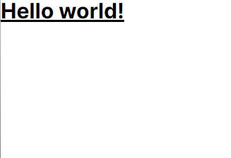
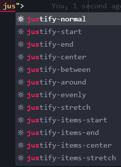
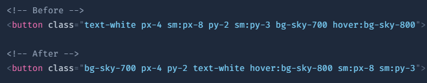

<p align="center">
  <a href="https://github.com/he4rt/4noobs" target="_blank">
    
  </a>
</p>

# Tailwind

> Sumário:
>
> - [Iniciando com Tailwind](#iniciando-com-tailwind)
> - [Pros e Contra](#pros-e-contra)
> - [Extensões de Auxílio](#extensões-de-auxílio)
> - [Conclusão](#conclusão)

# Iniciando com Tailwind

Diferente de outros frameworks de estilização, o Tailwind permite a aplicação de estilos através das **className**, ou seja, a estilização vai estar muito próximo as tags HTML que você está montando em sua aplicação. 

Eu sei, pode parecer estranho e bagunçado, mas fica calmo que vou te mostrar como as coisas são mais simples do que você pensa. 

Vamos dar uma olhada em um exemplo:

```jsx
export default function Home() {
  return (
    <h1 className="text-3xl font-bold underline">
      Hello world!
    </h1>
  )
}
```

<p align="center">
  
</p>

Nesse exemplo, estamos atribuindo três estilizações para a tag h1 que recebe o nosso "Hello world!". 

A primeira é referente ao **tamanho do texto**, a segunda é sobre **aplicar bold** e por último temos o **sublinhado** sendo aplicado. Claro, este é um exemplo simples, o Tailwind assim como o CSS tradicional tem milhares de possibilidades de estilizar o seu componente. 

Por isso, é indicado a [documentação](#https://tailwindcss.com/docs/installation) do Tailwind que vai auxiliar no processo de aprender os nomes das estilizações em comparação ao CSS tradicional.

---

# Pros e Contras

Como todo framework ou lib no mundo da programação, o Tailwind também tem seus pontos fracos e fortes, por isso vamos dar uma olhada em alguns deles para entendermos melhor do que o Tailwind é capaz.

### Pros

- Não pensar em nome de classes de estilo, como é no CSS in JS;
- Medidas de estilização padronizadas, facilitando seguir padrões;
- Não precisa ficar trocando entre diferentes arquivos e abas durante a produção;
- Facilidade em fazer mudanças de estilo sem sobrescrever os estilos de uma tag superior;
- Utilizar da componentização resolve a "bagunça" que o Tailwind deixa nas tags HTML;

### Contra

- Dependência de entender o setup do Tailwind e como mexer no seu arquivo de configuração, para customizar os estilos;
- Por ser “utility first” o HTML vai acabar consumindo mais espaço, já que aplicamos estilização diretamente neles;
- Não é a solução universal, muitas vezes temos que utilizar de alguns operadores condicionais, ou classes customizadas para realizar a estilização;
- Necessidade de aprender css da maneira Tailwind, já que algumas estilizações tem o nome um pouco diferente do css tradicional.

---

# Extensões de Auxílio

Para facilitar a vida na hora de usar Tailwind tem algumas extensões que facilitam a nossa vida, e deixo de indicação para uso:

### Tailwind IntelliSense
Extensão que habilita o auto complete na className para aplicar as estilizações.

<p align="center">
  
</p>

<p align="center">
   
</p>

---

### Tailwind Fold
Se o seu problema com Tailwind for a sujeira, essa extensão é para você!. Ela esconde todo o className deixando seu código muito mais "limpo".

<p align="center">
   
</p>

<p style="display: flex; flex-direction: row; align: center" >
   
     
</p>

---

### Tailwind Sort Class
Extensão para padronizar a ordem das estilizações na className.  

<p align="center">
  <a href="https://github.com/tailwindlabs/prettier-plugin-tailwindcss" target="_blank">
    
  </a>
</p>

<p align="center">
   
</p>

---

# Conclusão

Com isso, agora entendemos o que é Tailwind e sua função, conhecendo seus pontos a favor e contra e por fim tendo uma maior ideia de como utilizar em seus projetos, seja pessoal ou com o seu time. Além disso, percebemos que o objetivo do Tailwind é trazer padronização e produtividade para o projeto, assim facilitando a manutenção e compreensão do código.

Para tirar melhor aproveito do Tailwind, é recomendado ter uma base sólida de CSS, e somente depois aprender a maneira que o Tailwind aplica suas estilizações.

---

<p align="center">Made with 💜</p>

<p align="center">
  <a href="https://github.com/he4rt/4noobs" target="_blank">
    
  </a>
</p>

