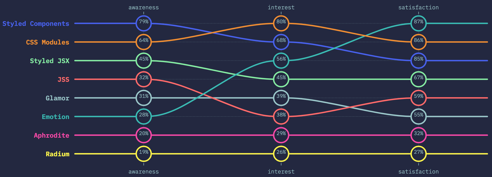

<p align="center">
  <a href="https://github.com/he4rt/4noobs" target="_blank">
    
  </a>
</p>

# CSS-in-JS

> 🔥 **Tá com pressa?** pega o resumo:
> 1. [O que é](#o-que-é-css-in-js)
> 2. [Vantagens](#quais-vantagens-as-bibliotecas-de-css-in-js-fornecem)
> 3. [Bibliotecas](#quais-as-principais-bibiliotecas)
> 3.1 💅 [Styled Components](#-styled-components)
> 3.2 📦 [CSS Modules](#-css-modules)
> 3.3 👩‍🎤 [Emotion](#-emotion)
> 4. [Na prática com Styled Components](#na-prática-com-styled-components)
> 5. [Conclusão](#conclusão)
> 9. [Referências](#referências)


## O que é CSS-in-JS?
É um conceito, uma coleção de ideias para resolver problemas complexos com CSS. Não é uma biblioteca em particular, então cada implementação pode focar em um subconjunto diferente de problemas usando abordagens diferentes. 

Todas elas têm em comum o fato de resolver os problemas usando APIs ao invés de convenções (normalmente a solução adotada em padrões CSS) e alavancam o JS como linguagem de escrita de estilos.

O objetivo do CSS-in-JS, no geral, é abstrair a complexidade de lidar com uma implementação de mais baixo nível, e evitar a troca de contexto.

> ⚠️ **Mas atenção!** Usar uma biblioteca em JavaScript para estilizar seu app não vai te livrar de entender o fundamental de CSS, beleza?

#### CSS-in-JS te permite...
- Escrever CSS usando sintaxe de JavaScript
- Aproveitar as vantagens do JS (funções, condicionais, variáveis, estados, ...)
- Aproveitar as vantagens de qualquer coisa do ecossistema JS


#### CSS-in-JS *não* vai te livrar de entender...
- Como estilos são aplicados no DOM
- Como funciona herança
- Como funcionam as propriedades de CSS
- Como funcionam os layouts em CSS


#### E onde entra o JS?
Para tirar um bom proveito desse paradigma, é importante conhecer os [tipos de dados em JS](https://github.com/ThiagoDellaNoce/javascript4noobs/blob/master/4_Basico/3_Tipos-de-dados.md). 

Também, para ir além, é bom conhecer os operadores [matemáticos](https://github.com/ThiagoDellaNoce/javascript4noobs/blob/master/4_Basico/5_Operadores-Aritmeticos.md), [lógicos](https://github.com/ThiagoDellaNoce/javascript4noobs/blob/master/4_Basico/6_Operadores-Logicos.md), [condicionais](https://github.com/ThiagoDellaNoce/javascript4noobs/blob/master/4_Basico/7_Condicionais.md), [spread](https://developer.mozilla.org/pt-BR/docs/Web/JavaScript/Reference/Operators/Spread_syntax), [destructuring](https://developer.mozilla.org/pt-BR/docs/Web/JavaScript/Reference/Operators/Atribuicao_via_desestruturacao), [módulos](https://developer.mozilla.org/pt-BR/docs/Web/JavaScript/Guide/M%C3%B3dulos) e [etc](https://github.com/ThiagoDellaNoce/javascript4noobs/tree/master/4_Basico)

> ⚠️ **Mas não te assusta!** Essas coisas vêm com a prática. Elas são do JavaScript, então, é natural que *possam* ser utilizadas em uma biblioteca CSS-in-JS, mas não quer dizer que é *obrigatório* usá-las.

---

## Quais vantagens as bibliotecas de CSS-in-JS fornecem?
As bibliotecas te permitem escrever CSS sem se preocupar com o efeito cascata (**C** do CSS). Também resolvem os problemas de especificidade, de dar nomes aos seletores, de seguir uma convenção de nomenclatura (*BEM CSS, estou olhando para você*), e todos os demais perrengues vindos de usar uma outra linguagem (*linting*, garantir consistência na estrutura de pastas, ferramentas de build).

Além disso, outras abstrações comumente implementadas em bibliotecas CSS-in-JS são:
- Eliminação de código morto (sem uso)
- O código vai dar erros (incluindo sintaxe, tipagem, *undefined*)
- Suporte a temas
- Estilos dinâmicos (com base em `props`, por exemplo)
- Estilos são "escopados" a um componente específico
- Otimizações de performance como gerar o _CSS crítico_ sem necessidade de configuração adicionjal

--- 

## Quais as principais bibiliotecas?

A última edição da pesquisa [State of CSS](https://2019.stateofcss.com/) constatou que a biblioteca mais popular é a [Styled Components](https://github.com/styled-components/styled-components), seguida por [CSS Modules](https://github.com/css-modules/css-modules) e [Styled JSX]().
Já as mais apreciadas são [Emotion](https://github.com/emotion-js/emotion), [CSS Modules](https://github.com/css-modules/css-modules) e [Styled Components](https://github.com/styled-components/styled-components).
Vamos entender melhor como essas três funcionam?

<p align="center">
  <a href="https://2019.stateofcss.com/technologies/css-in-js/" target="_blank">
    
  </a>
</p>

Critério|Cálculo
---|---
Awareness| Total de Respostas - Nunca ouviu falar / (Total de Respostas)
Interest| Interessado / (Interessado + Não interessado)
Satisfação| Usaria novamente / (Usaria novamente + Não usaria novamente)

### 💅 [Styled Components](https://github.com/styled-components/styled-components)
Utilizando [tagged template literals](https://www.styled-components.com/docs/advanced#tagged-template-literals) e [o poder do CSS](https://www.styled-components.com/docs/api#supported-css), `styled-components` permite escrever código CSS para estilizar os componentes. Também remove o mapeamento entre estilos e componentes, permitindo que se use componentes como construção de estilos de baixo nível de forma fácil.


`styled-components` é pensado para aprimorar CSS para estilizar sistemas de componentes React. Ao nos levar em conta um único caso de uso, foi possível otimizar a experiência para devs e também a saída para os usuários finais.

Além da experiência aprimorada para devs, os componentes estilizados fornecem:

- **CSS crítico automático:** `styled components` controla quais componentes são renderizados em uma página e injeta seus estilos e nada mais, de forma totalmente automática. Combinado com a divisão de código, isso significa que seus usuários carregam a menor quantidade de código necessária.
- **Nenhum erro de nome de classe:** os componentes com estilo geram nomes de classe exclusivos para seus estilos. Você nunca precisa se preocupar com duplicação, sobreposição ou erros ortográficos.
- **Exclusão mais fácil de CSS:** pode ser difícil saber se um nome de classe é usado em algum lugar em sua base de código. `styled components` torna isso óbvio, já que cada detalhe do estilo está vinculado a um componente específico. Se o componente não for usado (que as ferramentas podem detectar) e for excluído, todos os seus estilos serão excluídos com ele.
- **Estilo dinâmico simples:** adaptar o estilo de um componente com base em seus adereços ou um tema global é simples e intuitivo sem ter que gerenciar manualmente dezenas de classes.
- **Manutenção fácil:** você nunca precisa procurar em arquivos diferentes para encontrar o estilo que afeta seu componente, portanto, a manutenção é muito fácil, não importa o tamanho de sua base de código.
- **Prefixo automático:** escreva seu CSS de acordo com o padrão atual e deixe que `styled components` cuide do resto.

Você obtém todos esses benefícios enquanto escreve o CSS que conhece e adora, apenas vinculado a componentes individuais.

> 🔥 **Na prática:** [mais adiante](#na-prática-com-styled-components) você verá a biblioteca em mais detalhes, como instalar, como usar, e suas capacidades

```jsx
const Button = styled.button`
  color: grey;
`;
```

Também podem ser usados [objetos de estilo](https://styled-components.com/docs/advanced#style-objects), o que permite migrar gradualmente layouts existentes em *CSS inline*, já fornecendo o suporte aos recursos mais avançados.

```jsx
const Button = styled.button({
  color: 'grey',
});
```

Os dois estilos acima são equivalentes.

Styled Components é também compativel com React Native.


### 📦 [CSS Modules](https://github.com/css-modules/css-modules)
Um **Módulo CSS** é um arquivo CSS no qual todas as classes e animações são escopadas localmente por padrão. Todas as `url(...)` e os `@import`s são feitos da mesma forma que se requisita um módulo em JS.

CSS Modules compila para um formato intermediário chamado [ICSS](https://github.com/css-modules/icss), mas são escritos na forma padrão.
```css
/* style.css */
.error {
  background-color: red;
}
```

Ao importar um Módulo CSS em um módulo JS (um componente, por exemplo), é exportado um objeto com mapeamentos de nomes locais (que você escreveu) para nomes globais (que o módulo gerou).

```jsx
import styles from "./style.css";
// import { className } from "./style.css";

const btn = <button className={styles.error}>Error Button</button>;
```


### 👩‍🎤 [Emotion](https://github.com/emotion-js/emotion)
Emotion fornece uma composição de estilo poderosa e previsível, além de uma ótima experiência de desenvolvedor com recursos como _source maps_, _labels_ e utilitários de teste. Ambos os estilos de string e objeto são suportados.

O Emotion possui duas formas de uso, uma agnóstica de framework e outra específica para trabalho com React.

#### Forma agnóstica de framework:
```jsx
import { css, cx } from 'emotion'

const color = 'white'

render(
  <div
    className={css`
      padding: 32px;
      background-color: hotpink;
      font-size: 24px;
      border-radius: 4px;
      &:hover {
        color: ${color};
      }
    `}
  >
    Hover to change color.
  </div>
)
```

#### Com React
Essa abordagem possui suporte a ESLint, temas, e outros benefícios, mas exige mais configuração. Além disso, tem também suporte à sintaxe _styled_

##### clássico
```jsx
// this comment tells babel to convert jsx to calls to a function called jsx instead of React.createElement
/** @jsx jsx */
import { css, jsx } from '@emotion/core'

const color = 'white'

render(
  <div
    css={css`
      padding: 32px;
      background-color: hotpink;
      font-size: 24px;
      border-radius: 4px;
      &:hover {
        color: ${color};
      }
    `}
  >
    Hover to change color.
  </div>
)
```
##### styled
```jsx
import styled from '@emotion/styled'

const Button = styled.button`
  padding: 32px;
  background-color: hotpink;
  font-size: 24px;
  border-radius: 4px;
  color: black;
  font-weight: bold;
  &:hover {
    color: white;
  }
`

render(<Button>This my button component.</Button>)
```

---

## Na prática com Styled Components

Esse exemplo [está na documentação](https://styled-components.com/docs/basics#installation) 😄

### Instalação
Com NPM:
```bash
npm install --save styled-components
```

Com Yarn:
```bash
yarn add styled-components
```

> ⚠️ **Observação:** é altamente recomendado, mas não obrigatório, utilizar o [plugin do Babel](https://styled-components.com/docs/tooling#babel-plugin). Algumas vantagens são nomes de classes mais legíveis, SSR, bundle menor, e outros.

### Iniciando

`styled-components` usa [tagged template literals](https://www.styled-components.com/docs/advanced#tagged-template-literals) para estilizar os componentes. Essa abordagem elimina completamente o mapeamento entre estilo e componente. Ou seja, quando você define um estilo, você está criando um componente normal do React.

O exemplo abaixo cria dois componentes e usa eles.

```jsx
// Cria um componente Title, um h1 com estilos
const Title = styled.h1`
  font-size: 1.5em;
  text-align: center;
  color: palevioletred;
`;

// Cria um componente Wrapper, uma section estilizada
const Wrapper = styled.section`
  padding: 4em;
  background: papayawhip;
`;

// Use-os como você usaria qualquer outro componente
render(
  <Wrapper>
    <Title>
      Hello World!
    </Title>
  </Wrapper>
);
```

> 🔥 Detalhe! O css gerado já tem os prefixos de navegadores. Vai em frente, usa todas as propriedades hipsters que você conhece ;)

### Adaptando os componentes com base em props
O `styled-components` gera um componente, certo?
Se gera um componente, pode ter props.
E se tem props, você pode usar.

Esse exemplo abaixo tem um estado `primary` que muda as cores com base na presença (ou ausência) da prop. Para isso, basta usar a famosa [interpolação](https://developer.mozilla.org/pt-BR/docs/Web/JavaScript/Reference/template_strings) ;)
```jsx
const Button = styled.button`
  background: ${props => props.primary ? "palevioletred" : "white"};
  color: ${props => props.primary ? "white" : "palevioletred"};

  font-size: 1em;
  margin: 1em;
  padding: 0.25em 1em;
  border: 2px solid palevioletred;
  border-radius: 3px;
`;

render(
  <div>
    <Button>Normal</Button>
    <Button primary>Primary</Button>
  </div>
);
```

### Estendendo estilos
Às vezes precisamos fazer pequenas adaptações no layout de um componente.
Com o `styled-components`,  basta envolvê-lo no construtor `styled`:

```jsx
// Botão do exemplo acima, sem as interpolações
const Button = styled.button`
  color: palevioletred;
  font-size: 1em;
  margin: 1em;
  padding: 0.25em 1em;
  border: 2px solid palevioletred;
  border-radius: 3px;
`;

// Um novo Botão, baseado no anterior, com alguns detalhes a mais
const TomatoButton = styled(Button)`
  color: tomato;
  border-color: tomato;
`;

render(
  <div>
    <Button>Normal Button</Button>
    <TomatoButton>Tomato Button</TomatoButton>
  </div>
);
```

Ainda, é possível substituir o elemento gerado. Por exemplo, se quiséssemos que, ao invés de um `button`, nosso componente `TomatoButton />` gerasse um `a`, é só fazer:
```jsx
<Button as="a" href="/">Link com estilos de Button</Button>
```

> 📚 **Leitura recomendada:** [Talia Marcassa](https://twitter.com/talialongname) escreveu uma ótima revisão do uso no mundo real, apresentando muitos insights práticos sólidos e comparações com alternativas, em [Styled Components: To Use or Not to Use?](https://medium.com/building-crowdriff/styled-components-to-use-or-not-to-use-a6bb4a7ffc21)

### Sintaxe

O `styled-components` usa um [pré-processador](./Preprocessadores%20CSS.md) chamado [stylis](https://github.com/thysultan/stylis.js), que suporta a sintaxe do SCSS.

```jsx
const Thing = styled.div.attrs((/* props */) => ({ tabIndex: 0 }))`
  color: blue;

  &:hover {
    color: red; // <Thing> quando passamos o mouse
  }

  & ~ & {
    background: tomato; // <Thing> como irmão de <Thing>, mas talvez não diretamente adjacente
  }

  & + & {
    background: lime; // <Thing> adjacente a <Thing>
  }

  &.something {
    background: orange; // <Thing> tagueado com uma classe CSS adicional ".something"
  }

  .something-else & {
    border: 1px solid; // <Thing> dentro de outro elemento nomeado ".something-else"
  }
`

render(
  <React.Fragment>
    <Thing>Hello world!</Thing>
    <Thing>How ya doing?</Thing>
    <Thing className="something">The sun is shining...</Thing>
    <div>Pretty nice day today.</div>
    <Thing>Don't you think?</Thing>
    <div className="something-else">
      <Thing>Splendid.</Thing>
    </div>
  </React.Fragment>
)
```

### Anexando props adicionais

Para evitar wrappers desnecessários que apenas passam algumas props para o componente ou elemento renderizado, você pode usar o [construtor `.attrs`](https://styled-components.com/docs/api#attrs). Ele permite que você anexe props adicionais (ou "atributos") a um componente.
Dessa forma, você pode, por exemplo, anexar props estáticas a um elemento ou passar uma prop de terceiros como  `activeClassName` para o componente `Link` do `React Router`. 
Além disso, você também pode anexar props mais dinâmicas a um componente. O objeto `.attrs` também pode receber funções, que recebem as props que o componente recebe. O valor de retorno será mesclado com os props resultantes também.


Aqui, renderizamos um componente `input` e anexamos alguns atributos dinâmicos e estáticos a ele:

```jsx
const Input = styled.input.attrs(props => ({
  // podemos definir props estáticas
  type: "text",

  // ou definir props dinâmicas
  size: props.size || "1em",
}))`
  color: palevioletred;
  font-size: 1em;
  border: 2px solid palevioletred;
  border-radius: 3px;

  /* aqui usamos a prop computada dinamicamente */
  margin: ${props => props.size};
  padding: ${props => props.size};
`;

render(
  <div>
    <Input placeholder="Um input pequeno" />
    <br />
    <Input placeholder="input maior" size="2em" />
  </div>
);
```

### Animações

Por fim, vamos dar aquela animada nos nossos componentes?
Animações CSS definidas com `@keyframes` são globais, e isso pode levar a colisão de nomes. O `styled-components` fornece um helper para mitigar esse problema:

```jsx
// Criar a animação
const rotate = keyframes`
  from {
    transform: rotate(0deg);
  }

  to {
    transform: rotate(360deg);
  }
`;

// Criar um componente que vai rotacionar o que receber
const Rotate = styled.div`
  display: inline-block;
  animation: ${rotate} 2s linear infinite;
  padding: 2rem 1rem;
  font-size: 1.2rem;
`;

render(
  <Rotate> < 💅🏾 > </Rotate>
);
```

> ⚠️ Keyframes não é suportada pelo React Native.


---

## Referências

### Conceitos
[Do Sass e BEM ao CSS-in-JS: A (re)evolução do CSS ao longo da história 🚀](https://www.felipefialho.com/blog/do-sass-e-bem-ao-css-in-js-a-evolucao-do-css-ao-longo-da-historia/) - Felipe Fialho
[What actually is CSS-in-JS?](https://medium.com/dailyjs/what-is-actually-css-in-js-f2f529a2757) - Oleg Isonen
[The tradeoffs of CSS-in-JS](https://medium.com/free-code-camp/the-tradeoffs-of-css-in-js-bee5cf926fdb) - Oleg Isonen
[CSS-in-JS](https://en.wikipedia.org/wiki/CSS-in-JS) - Wikipedia
[Why you should definitely learn how to use CSS-in-JS](https://jxnblk.com/blog/why-you-should-learn-css-in-js/) - Brent Jackson

### Bibliotecas
[Utilizando Styled Components (CSS-in-JS) no ReactJS e React Native | Diego Fernandes](https://www.youtube.com/watch?v=R3S8DEzEn6s) - RocketSeat
[Styled Components, por onde começar? Os poderes do CSS in JS](https://www.youtube.com/watch?v=QdfjWRc4ySA) - Mario Souto
[JSS](https://cssinjs.org/?v=v10.4.0) - JSS
[Basics](https://styled-components.com/docs/basics#installation) - Styled Components

---

## Conclusão

Entendemos agora o que é e para que serve o CSS-in-JS. Também conhecemos um pouco as principais bibliotecas utilizadas no mercado, e vimos na prática como funciona o Styled Components.

O objetivo do CSS-in-JS, no geral, é simplificar o processo de desenvolver o estilo da aplicação, e mitigar alguns dos problemas comuns como conflito de nomes e especificidade.

Para tirar melhor proveito dessa abordagem, é essencial que se conheça os conceitos básicos de CSS e de JavaScript, beleza?

...

...

Achou algo de errado? Algo que possa melhorar? Fique a vontade para [abrir uma issue](https://github.com/he4rt/react4noobs/issues). Vejo você na próximo seção!

<p align="center">Made with :purple_heart:</p>

<p align="center">
  <a href="https://github.com/he4rt/4noobs" target="_blank">
    
  </a>
</p>
