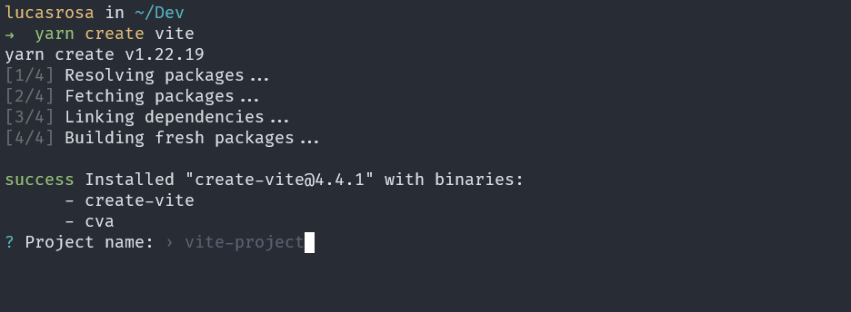
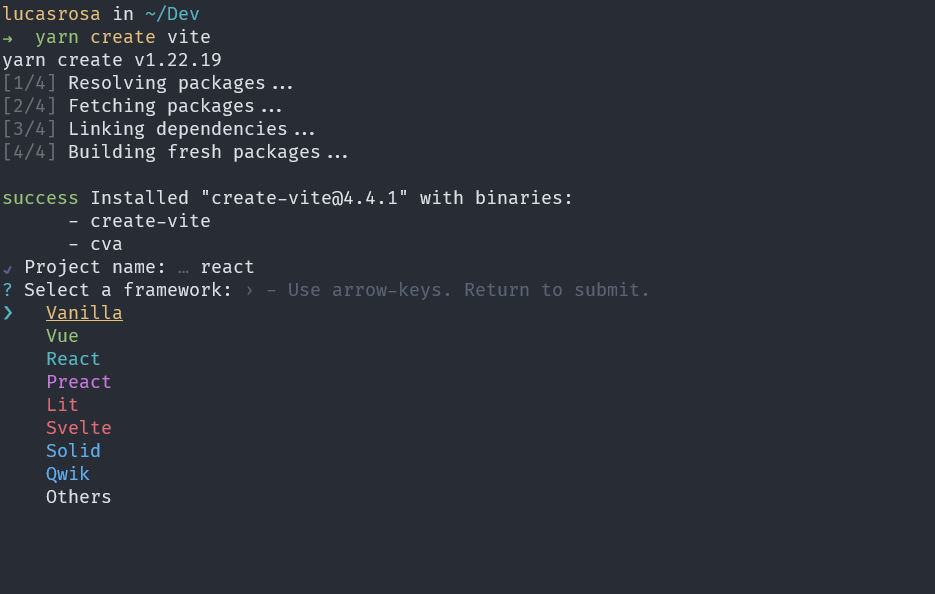
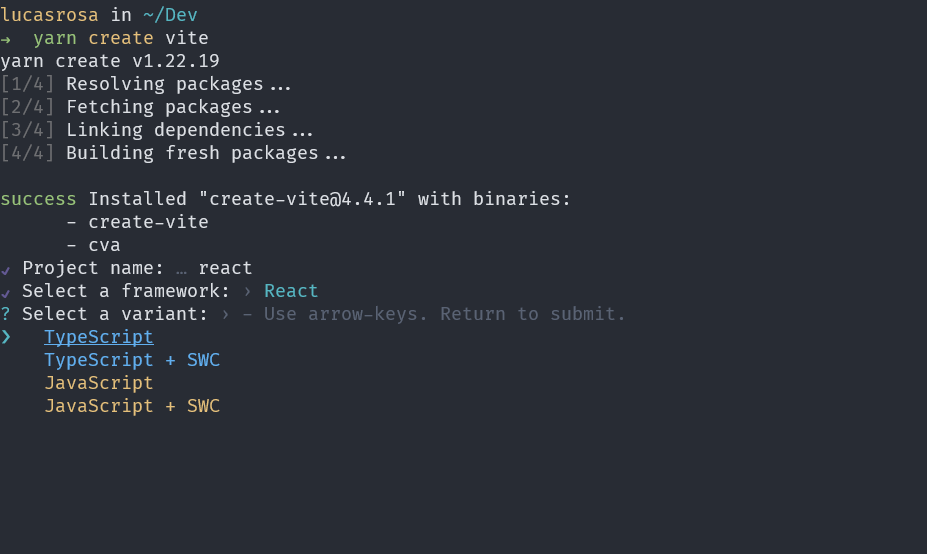
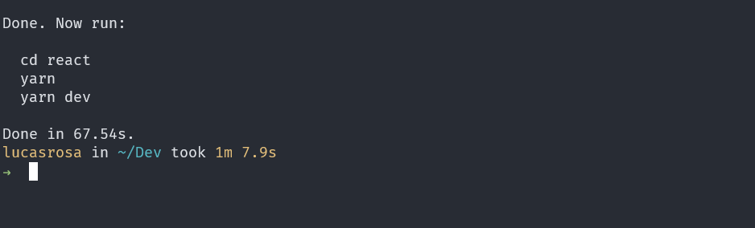

<p align="center">
  <a href="https://github.com/he4rt/4noobs" target="_blank">
    
  </a>
</p>

# React

## Iniciando um projeto

Como já sabemos o `React` é uma biblioteca! E para podermos utiliza-la precisamos instalar os pacotes necessários em nosso projeto.

Até o ano passado, utilizavamos uma ferramenta muito conhecida chamada `create-react-app` que era fornecido pela propria biblioteca para iniciarmos nosso projeto. Ela criava uma estrutura de pastas e instalava todos os pacotes necessários para que pudessemos utilizar o React. Era algo como:

```js
npx create-react-app <nome-do-projeto>
```

Porém recentemente esta mesma ferramenta foi depreciada, ou seja não é mais recomendava e provavelmente nem terá mais suporte/atualizações.

Portanto, hoje temos algumas opções e as mais recomendadas são algumas frameworks que já são bem robustas no mercado! (Não entraremos a fundo a respeito dessas frameworks por agora, cada uma delas terá sua propria seção neste projeto)

- NextJS

```js
npx create-next-app
```

- Remix

```js
npx create-remix-app
```

- Gatsby

```js
npx create-gatsby
```

\_ Expo(Para mobile)

```js
npx create-expo-app
```

Estas são algumas das opções que a propria documentação do `React` nos fornece, porém todas elas muitas vezes são muito robustas para utilizarmos em coisas pequenas. A famosa frase `"Utilizar uma bazuca para matar uma formiga"`.

Dito isto, temos opções criando nossa propria configuração personalizada ou utilizando o [Vite](https://vitejs.dev/) ou [Parcel](https://parceljs.org/).

Mostraremos como começar com o Vite pois ele já oferece comandos sem nenhuma configuração para todos.

Para projetos React com javascript, basta utilizar o comando:

```js
yarn create vite
```

```js
npm create vite@latest
```






Você também pode iniciar os projetos já colocando o nome através do comando.

```js
yarn create vite@latest react4noobs --template react
```

Caso tu queira começar um projeto `React com typescript`, basta mudar o template para `--template react-ts` ou escolher através da interface que aparecerá quando por comando!

Então é isto, agora sabemos que hoje no mercado temos algumas frameworks bem robustas e diversas formas de iniciar um projeto com React. Então cabe a ti escolher qual a que vale mais apena para o seu projeto.

[Ir para Próxima Seção](./3-JSX%20e%20Babel.md)

<p align="center">Made with :purple_heart:</p>

<p align="center">
  <a href="https://github.com/he4rt/4noobs" target="_blank">
    
  </a>
</p>
