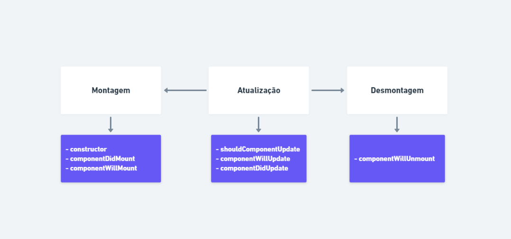

<p align="center">
  <a href="https://github.com/he4rt/4noobs" target="_blank">
    
  </a>
</p>

# Ciclo de vida

Neste capítulo você entenderá o que é **Ciclo de vida** no React.

## Introdução

Quando estamos utilizando o React que tem por base a componentização, **é preciso entender como que tudo funciona para que possamos saber o que fazer e quando fazer algo.** Todos os componentes possuem um ciclo de vida que vai desde o momento em que ele aparece na tela até ele desaparecer da tela.

O objetivo desse ciclo é gerenciar os recursos da aplicação, ou seja, tudo que não está em tela é "destruido" ou apagado pra poder garantir recursos para os que estão em tela.

Ainda não entendeu? Vamos para um exemplo:

Você tem dois componentes em tela, porém após alguma ação do usuário um dos componentes desaparece da tela. Nesse momento o React "destroi"/apaga ele da DOM para guardar recursos e garantindo que todo o resto continue funcionando.

Enfim, vamos ao que interessa!

O React permite que manipulemos o ciclo de vida e podemos dividir o mesmo em 3 momentos:

- Montagem (Quando aparece em tela)
- Atualização (Quando altera um dado em tela)
- Desmontagem (Quando desaparece da tela)



## Montagem

Nesta etapa ocorre quando **nosso componente aparece em tela da primeira vez**, quando ele é colocado na DOM. Então nosso componente é renderizado em tela com todas as props que passamos para ele, todas as requisições de dados e etc.

Temos três funções nesta etapa:

- **componentWillMount** → Essa etapa é executada antes mesmo da montagem do componente, aqui colocamos ações das quais queremos que execute no inicio do nosso componente. Como por exemplo chamadas na API, tratamento de dados recebidos e por ai vai.

  > O equivalente dele no React Hooks é ouseLayoutEffect.
  > Exemplo:
  > Para todos os exemplos utilizaremos uma biblioteca chamada Axios para lidar com asrequisições, ela possui algumas vantagens em relação a fetch api nativa do JS mas você pode utilizar o que você bem entender.

```jsx
import React from "react";
import axios from "axios";
class CardPerson extends React.Component {
  constructor() {
    super();
    this.state = {
      name: "",
      birthday: "",
    };
  }
  // Funcão para pegar os dados
  async loadData() {
    try {
      // Fazemos uma requisição para algumaapi
      const response = await axios.get("URLDE ALGUMA API");
      // Após pegar os dados setamos ele noestado
      this.setState({
        name: response.data.name,
        birthday: response.data.birthday,
      });
    } catch (error) {
      console.log("error");
    }
  }
  componentWillMount() {
    loadData();
  }
  render() {
    return (
      <div>
        <h1>{this.state.name}</h1>
        <h2>{this.state.birthday}</h2>
      </div>
    );
  }
}
```

ATENÇÃO!
Essa é uma parte do ciclo quase não utilizada, pois existem diversos problemas. Atualmente no React é recomendando o usar ocomponentDidMount.

<br/>

- **constructor** (No caso dos componentes de classe) → No caso dos componentes de classe, é nessa etapa que definimos as propriedades, estados e em alguns casos um bind para que o nosso _this_ faça referência ao componente.

<br/>

- **componentDidMount →** Basicamente ocorre após a montagem do componente na DOM, ou seja após o método **render.** Nessa etapa colocamos ações das quais queremos que execute no inicio do nosso componente. Como por exemplo chamadas na API, tratamento de dados recebidos e por ai vai.

> Seu equivalente no React Hooks é o useEffect.

```jsx
import React from "react";
import axios from "axios";
class CardPerson extends React.Component {
  constructor() {
    super();
    this.state = {
      name: "",
      birthday: "",
    };
  }
  // Funcão para pegar os dados
  async loadData() {
    try {
      // Fazemos uma requisição para alguma api
      const response = await axios.get("URLDE ALGUMA API");
      // Após pegar os dados setamos eles no estado
      this.setState({
        name: response.data.name,
        birthday: response.data.birthday,
      });
    } catch (error) {
      console.log("error");
    }
  }
  componentDidMount() {
    loadData();
  }
  render() {
    return (
      <div>
        <h1>{this.state.name}</h1>
        <h2>{this.state.birthday}</h2>
      </div>
    );
  }
}
```

Após a renderização do componente em tela, ele irá executar uma função que irá pegar dados de alguma api nossa, para então pegar esses dados e coloca-los nos estados.
Vamos supor que fazemos uma chamada a api que retorna os dados:{name: "Heart", birthday:"13/13/2090"}. Essa chamada só irá ocorrer depois que o componente estiver em tela, após ser concluida ela irá atualizar os estados e consequentemente alterar os dados em tela para: Heart e 13/132020.

A diferença pode parecer que é apenas o nome mas tudo muda completamente. Agora só estamos fazendo a requisição após o componente estar na DOM e não antes.

## Atualização

Esta etapa está relacionada a qualquer atualização ou mudança de dados em tela. Seja quando uma propriedade ou até mesmo um estado seja alterado.
Temos três funções nesta etapa:

  <br/>

- **shouldComponentUpdate** → Essa função será chamada sempre que um estado ou propriedade for chamada. Nela você pode decidir se o componente irá renderizar novamente ou não, por padrão ele re-renderiza.
  Esse método existe apenas para questão de performance, confiar nele para evitar re-renderização pode ocasionar bugs indesejados.

```jsx
import React from "react";
import axios from "axios";

class CardPerson extends React.Component {
  constructor(props) {
    super();
    this.state = {
      name: props.name,
      birthday: props.birthday,
    };
  }
  // Essa função recebe as próximas props e state
  shouldComponentUpdate(nextProps, nextState) {
    return nextProps.name !== this.state.name;
  }
  render() {
    return (
      <div>
        <h1>{this.state.name}</h1>
        <h2>{this.state.birthday}</h2>
      </div>
    );
  }
}
```

Ok, mas o que está acontecendo? Bom, estamos dizendo que quando ocorrer uma atualização de dados, o componente deve atualizar somente quando o novo nome for diferente do que está no estado atual

**Devo alertar novamente que essa função é utilizada em casos muito raros e não é recomendada sua utilização sem um motivo concreto.**

<br/>

- **componentWillUpdate** → Essa função é executada no momento da atualização de dados (props ou estados) e assim como a anterior define se o componente deve renderizar novamente ou não. Atualmente é um método marcado como inseguro pela própria documentação do React e recomenda-se que seja substituído pelo componentDidUpdate que falaremos a seguir.

<br/>

- **componentDidUpdate** → Esse metodo é chamado logo após do componentDidMount, basicamente ele que você irá utilizar para checar se ocorreu alguma atualização de dados. Um bom exemplo é quando seu componente precisa fazer uma requisição para uma API sempre que um dado muda.

> Seu equivalente no React Hooks é o useEffect

```jsx
import React from "react";
import axios from "axios";
class CardPerson extends React.Component {
  constructor(props) {
    super(props);
    this.state = {
      name: props.name,
      birthday: "",
    };
  }
  // Funcão para pegar os dados
  async loadData() {
    try {
      // Fazemos uma requisição para alguma api
      const response = await axios.get("URL DE ALGUMA API");
      // Após pegar os dados setamos eles no estado
      this.setState({
        name: response.data.name,
        birthday: response.data.birthday,
      });
    } catch (error) {
      console.log("error");
    }
  }
  // Guarda as propriedades e estados anteriores
  componentDidUpdate(prevProps, prevState) {
    if (prevState.name !== this.state.name) {
      loadData();
    }
  }
  render() {
    return (
      <div>
        <h1>{this.state.name}</h1>
        <h2>{this.state.birthday}</h2>
      </div>
    );
  }
}
```

Aqui sempre que o name for alterado,faremos uma requisição nova na api para pegar os novos dados.

## Desmontagem

Esta é a ultima etapa, é quando o componente não é mais necessário em tela e portanto deve ser removido. Aqui temos apenas a função **componentWillUnmount.**

- **componentWillUnmount** → Essa função ocorre sempre que um componente é removido de tela para garantir que ele não permaneça na DOM. É uma parte importante porém tu só mexe em casos muito específicos, por exemplo: Limpar algum dado durante a desmontagem que você definiu durante a montagem(**componentDidMount**).

## Conclusão

Concluímos que o ciclo de vida dos componentes no React é algo muito bem trabalhado e interessante. Podemos não apenas entender mas também manipula-los para realizar diversas ações.
Bom, até então em todos os exemplos utilizamos a abordagem mais clássica do React que são os componente de classe. Porém é algo não muito utilizado nos dias de hoje, com a vinda dos _React Hooks_ se tornou muito melhor desenvolver utilizando componentes de função.
Nos próximos tópicos você aprenderá sobre oque são hooks, como utilizar e seus equivalentes em relação ao ciclo de vida!

[Ir para Próxima Seção](./7-React%20Hooks.md)

<p align="center">Made with :purple_heart:</p>

<p align="center">
  <a href="https://github.com/he4rt/4noobs" target="_blank">
    
  </a>
</p>
