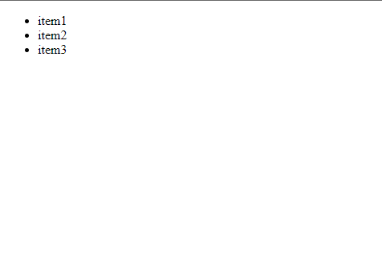
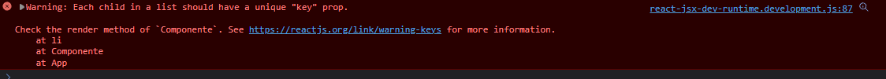

<p align="center">
  <a href="https://github.com/he4rt/4noobs" target="_blank">
    
  </a>
</p>

# Listas

> Sumário:
>
> - [Como renderizar uma lista](#como-renderizar-uma-lista)
> - [Oque são Keys e por que precisamos delas](#o-que-são-keys-e-por-que-precisamos-delas)
> - [Posso utilizar Fragments ao renderizar uma lista?](#posso-utilizar-fragments-ao-renderizar-uma-lista)
> - [Conclusão](#conclusão)

# Como renderizar uma lista

Durante o desenvolvimento de um aplicativo é muito comum em algum momento você precisar mostrar em tela uma lista de itens, sejam lá quais sejam eles. Obviamente voçê não irá pegar e por um por um no código, não seria prático e quase impossivel de dar manutenção. <br/>
No React, graças ao JSX conseguimos renderizar listas de uma forma bem simples utilizando uma função existente nos `arrays` chamada `map`. Com isso, podemos iterar sobre uma lista e retornar `componentes React` de acordo com a mesma.

```jsx
const lista = ['item1', 'item2', 'item3'];

function Componente() {
  return (
    <ul>
      {lista.map((item) => {
        return <li>{item}</li>;
      })}
    </ul>
  );
}
```

<p align="center">


</p>

Como podemos ver no código acima, literalmente realizamos um map de nossa lista para que retorne um componente/tag para cada item.

Ahn, vale lembrar que também podemos utilizar do `retorno explicito` para deixar o código mais enxuto. Utilizamos essa forma principalmente quando precisamos apenas renderizar o componente sem nenhum tipo de processamento, calculo e etc. Como por exemplo: `Criar uma variavel pra renderizar algum tipo de dado a depender do conteudo do item.` <br/>

Vale ressaltar que só é permitido ser retornado `um` componente por retorno, ou seja, caso precise que retorne mais de um... Englobe-o com um `fragment`, uma `div` ou alguma outra tag.

```jsx
const lista = ['item1', 'item2', 'item3'];

function Componente() {
  return (
    <ul>
      {lista.map((item) => (<li>{item}</li>)}
    </ul>
  );
}
```

Voçê sabia que os exemplos acima tem um problema?
Então, se rodar os exemplo e abrir o `inspetor` do seu navegador, irá se deparar com a seguinte mensagem de erro:

<p align="center">

</p>

O erro basicamente diz para gente: `Cada item de uma lista precisa ter uma chave(key) unica`.

# O que são Keys e por que precisamos delas

A este ponto, a pergunta principal deve ser: "Certo, mas o que são essas tais keys?" Basicamente o atributo key é um identificador unico que pode ser uma `string` ou `número` para que o `React` possa encontrar nosso elemento na `DOM(Document Object Modal)` e realizar as atualizações corretas(Adicionar em tela, remover da tela, alterar valores e etc.).

```jsx
const lista = ['item1', 'item2', 'item3'];

function Componente() {
  return (
    <ul>
      {lista.map((item) => (<li key={item}>{item}</li>)}
    </ul>
  );
}
```

Você sempre deve selecionar alguma informação `unica` para atribuir a uma `key`. E essas keys não podem mudar, caso contrario elas perdem o seu proposito.

`!!Nota importante -> Evite utilizar` <br/>

- A `index(posição)` do elemento na lista como `key`, pois dentro de um array pode ocorrer diversas alterações, como reordenação. <br/>
- O `Math.random()` pois ele gera números aleatórios e a cada renderização os proprios irão ser alterados.

Lembre-se que `keys` são propriedades que o React utiliza para um proposito e ela existe `apenas` para a biblioteca. Se por acaso a informação que tu passa pelas `keys` precise que seu componente receba como propriedade para realizar algo, crie uma nova propriedade e atribua o valor ao mesmo.

```jsx
<Componente key={name} name={name} />
```

# Posso utilizar Fragments ao renderizar uma lista?

Sim, podemos utilizar `Fragments` em uma lista, mas não da forma que estamos acostumados. Pois Fragments nada mais são que uma forma de agrupar diversos elementos sem precisar utilizar uma tag html especifica. Quando renderizado, ele basicamente desaparece e renderiza na nossa arvore apenas o seu conteudo. Por isso que para se usar nas listas, onde precisamos sempre declamar a `key`, é preciso da importação do componente `Fragment` do react para utilizarmos.

Normalmente utlizamos o componente através da famosa abreviação.

```jsx
<>
  <div />
  <div />
  <div />
</>
```

Mas para listas, precisa ser assim:

```jsx
import { Fragment } from 'react';

const lista = [
  {
    id: 1,
    name: 'Fulano',
    idade: 15,
  },
  {
    id: 2,
    name: 'Fulano2',
    idade: 15,
  },
];

function Componente() {
  return (
    <div>
      {lista.map((item) => {
        return (
          <Fragment key={item.id}>
            // Geralmente por Id`s serem propriedades únicas, é muito utilizado
            como keys.
            <span>{item.name}</span>
            <span>{item.idade}</span>
          </Fragment>
        );
      })}
    </div>
  );
}
```

# Conclusão

Até aqui vimos como renderizar as listas no react e o motivo para algumas especificidades.
A renderização de listas é algo que você com certeza irá utilizar no dia a dia e é muito importante saber as regras. <br/>

Esperamos que este conteudo tenha te ajudado a entender melhor a respeito das listas. Também deixo aqui o [link da documentação](https://react.dev/learn/rendering-lists#challenges) do React para caso queira ver direto da fonte.
Nos vemos no próximo capitulo, seeyaa!

[Ir para a próxima seção](./7-Manipulando%20Eventos.md)

<p align="center">
  <a href="https://github.com/he4rt/4noobs" target="_blank">
    
  </a>
</p>

``
