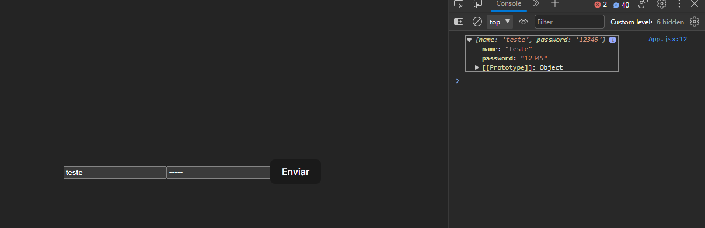
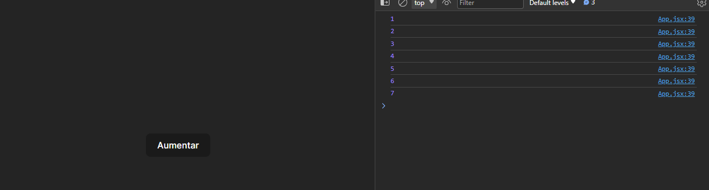
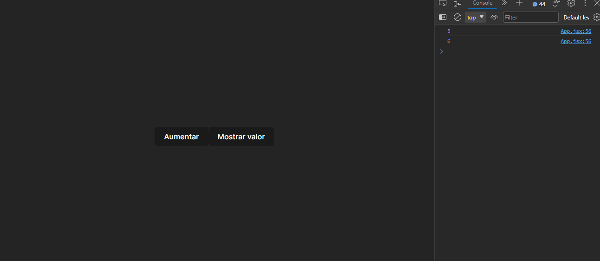

<p align="center">
  <a href="https://github.com/he4rt/4noobs" target="_blank">
    
  </a>
</p>

# Refs

Hoje falaremos sobre refs no React! O que são elas? Quais são os seus usos? Como podemos utilizá-las no nosso dia a dia?

> Sumário:
>
> - [O que é uma ref?](#o-que-é-uma-ref)
> - [Formas de criar uma ref](#formas-de-criar-uma-ref)
> - [Como manipular a DOM com uma ref?](#como-manipular-a-dom-com-uma-ref)
> - [Como utilizar uma ref para armazenar valores](#como-utilizar-uma-ref-para-armazenar-valores)
> - [Como passar uma ref para componentes customizados?](#como-passar-uma-ref-para-componentes-customizados)
> - [Conclusão](#conclusão)

# O que é uma ref

No React, `ref` é uma referência de valor. Ela tem o poder de armazenar informações sem desencadear uma nova renderização, ao contrário dos estados. Também é usada para manipular elementos da `DOM` (o React oferece suporte total para esse tipo de documentação, portanto, é preferível usar `refs` em vez da manipulação direta por meio do document).

# Formas de criar uma ref

A nossa querida biblioteca fornece apenas duas formas de criar uma `ref`.

1.  A forma mais moderna: através do hook [useRef]("./8.4-useRef.md") para componentes funcionais.

```jsx
   import {useRef} from 'react'

   const Componente = () => {
     const ref = useRef(null)

     ...//Seu código abaixo
   }
```

2.  A forma mais antiga é `createRef`, usada para instanciar refs em componentes de classe.

```jsx
  import {createRef, Component} from 'react'

  class Componente extends Component {
    someRef = createRef()

  ...//Seu código abaixo

  }
```

Ambas as formas retornam para nós um objeto com a propriedade `current`. Essa propriedade irá conter o valor com o qual inicializamos nossa `ref`. Em outras palavras, se a criarmos declarando um objeto, o ref.current conterá um objeto; se a inicializarmos com um número (por exemplo, o número 5), o `ref.current` conterá o número 5.

Caso tenha interesse em saber mais sobre o `useRef`, basta clicar [aqui]("./8.4-useRef.md") para ser redirecionado para o artigo deste hook. Lembrando que para todos os tópicos a seguir, iremos utilizar o `useRef`. Então caso você tenha interesse de ver exemplos com o `createRef`, recomendo fortemente esta [página na documentação do React](https://react.dev/reference/react/createRef#createref).

# Como manipular a DOM com uma Ref

No React, conseguimos passar a propriedade `ref` em praticamente todas as tags HTML e componentes, tudo isso por meio da propriedade `ref`.

```jsx
import {useRef} = 'react'

function Componente(){
  const ref = useRef()

  return (
    <div>
      <input type="text" ref={ref}/>
    </div>
  )
}
```

No exemplo acima, adicionamos a nossa `ref` ao componente input. Com isso, o nosso `ref.current` trará informações a respeito do input.

Caso tenha testado este código localmente e utilizado um `console.log` na `ref`, irá notar que no primeiro log o resultado será `undefined`. Isso acontece porque a atribuição do elemento apenas ocorrerá durante a montagem do nosso componente, e também não declaramos um valor inicial para o mesmo.

Enfim, dentro do ref.current, temos acesso a diversas informações do componente, da mesma forma que teríamos ao utilizar o document.getElementsByTagName ou algum outro método de pesquisa na DOM.

### Exemplos - Manipulando um input não controlado

Neste exemplo, teremos um input onde o usuário pode escrever o que bem entender. Não iremos controlá-lo, ou seja, não iremos criar um estado e uma função para armazenar os valores e ditar quais regras o componente deve seguir para salvá-los. Queremos apenas pegar o valor digitado quando formos finalizar o nosso formulário.

```jsx
import { useRef } from 'react';

function Formulario() {
  const inputNameRef = useRef(); // Ref responsável pelo input onde será digitado o nome.
  const inputPasswordRef = useRef(); // Ref responsavél pelo input onde será digitada a senha.

  const onSubmit = (event) => {
    event.preventDefault(); // Evitar o comportamento padrão dos formulários, ou seja evitar que a tela recarregue.
    console.log({
      name: inputNameRef.current.value,
      password: inputPasswordRef.current.value,
    });

    // Quando essa função for executada, deverá printar no nosso console exatamente o que está escrito nos componentes.
  };

  return (
    <form onSubmit={onSubmit}>
      <input type='text' placeholder='Digite seu nome' ref={inputNameRef} />
      <input
        type='password'
        placeholder='Digite sua senha'
        ref={inputPasswordRef}
      />

      <button type='submit'>Enviar</button>
    </form>
  );
}
```

Resultado


# Como utilizar uma ref para armazenar valores

Bem, como já vimos anteriormente, podemos atribuir uma `ref` a um elemento HTML. Além disso, podemos atribuir valores, sejam números, textos ou até mesmo objetos! A maior vantagem é que essas alterações não geram uma re-renderização em nossa aplicação.

### Exemplo - Contador que não mostra em tela.

```jsx
import { useRef } from 'react';

function Componente() {
  const counter = useRef(0);

  const updateCounter = () => {
    counter.current += 1;
    console.log(counter.current);
  };

  return (
    <div>
      <button onClick={updateCounter}>Aumentar</button>
    </div>
  );
}
```



Basicamente, não ocorre novas renderizações em tela, apenas os logs do valor sendo atualizado.

### Exemplo - Contador que pode mostrar o valor em tela.

```jsx
import { useRef, useState } from 'react';

function Componente() {
  const [value, setValue] = useState(null);
  const [showValue, setShowValue] = useState(false);
  const counter = useRef(0);

  const updateCounter = () => {
    counter.current += 1;
    console.log(counter.current);
  };

  const toggleShowValue = () => setShowValue((prevState) => !prevState);

  return (
    <div>
      <button onClick={updateCounter}>Aumentar</button>
      <button onClick={toggleShowValue}>
        {showValue ? 'Esconder valor' : 'Mostrar valor'}
      </button>

      {showValue && <h1>{value}</h1>}
    </div>
  );
}
```




Certo, mas qual a diferença em relação ao exemplo anterior? Basicamente, como as `refs` não disparam novas renderizações, não podemos obter atualizações em tempo real na tela. Por isso, torna-se necessário utilizar estados para lidar com o mesmo.

A partir desse ponto, a imaginação é o limite! É possível fazer muitas coisas. Inclusive, na própria documentação do React (link no final do artigo), existe um exemplo de um cronômetro que utiliza o `ref.current` como um `setInterval`.

# Como passar uma ref para componentes customizados

Normalmente, quando vamos usar em nossa aplicação algum componente, como o input ou qualquer outro, criamos um componente customizado para garantir que, em todos os locais de nossa aplicação, tenhamos o mesmo design e comportamento. No caso do input, talvez em algum momento você queira usá-lo sem nenhum controle, ou seja, como um `uncontrolled component`, e para isso usaríamos as `refs` que aprendemos anteriormente. No entanto, tenho uma má notícia: não conseguiríamos usá-lo da mesma forma que antes.

```jsx
const CustomInput = ({value, label, onChange, ...rest}) => {
  return {
    <input value={value} onChange={onChange} {...rest}/>
  }
}

const App = () => {
  return (
    <CustomInput  ref={ref} {/* Outras propriedades */}/>
  )
}
```

Essa forma mencionada anteriormente não funcionará. Isso ocorre porque, por padrão no React, nossos componentes não expõem as refs para os elementos da `DOM` dentro deles (como inputs, tags, etc.).

Para resolver esse problema, nossa querida biblioteca nos disponibiliza a função, ou melhor dizendo, um `HOC (High Order Component)`, que permite passar as refs para baixo.

Para utilizá-lo, basta passar o componente desejado como `primeiro parâmetro`.

Nossos componentes sempre recebem as refs como `segundo parâmetro`, ou seja, `Component(props, ref)`.

Podemos ver no exemplo abaixo que é bem simples de usar e não tem muito segredo.

```jsx
import {forwardRef} from 'react'
const CustomInput = ({value, label, onChange, ...rest}, ref) => {
  return {
    <input value={value} onChange={onChange} ref={ref} {...rest}/>
  }
}

export default forwardRef(CustomInput)

// ou

const CustomInput = forwardRef(({value, label, onChange, ...rest}, ref) => {
  return {
    <input value={value} onChange={onChange} ref={ref} {...rest}/>
  }
})
```

No App, continuaria a mesma coisa.

```jsx
const App = () => {
  return (
    <CustomInput  ref={ref} {/* Outras propriedades */}/>
  )
}
```

# Conclusão

Neste artigo, vimos um pouco sobre `refs` e como utilizá-las de diversas formas. As `refs` são uma maneira de lidar com valores sem causar re-renderizações e até mesmo de obter informações dos componentes sem precisar utilizar os métodos da `DOM`. Muitas bibliotecas, principalmente as de formulários, como o `React Hook Form`, utilizam essa estratégia de `refs` por questões de desempenho.

Caso queira se aprofundar ainda mais em tudo o que foi discutido aqui, deixo os links da documentação oficial do React.

- [Referencing Values with Refs](https://react.dev/learn/referencing-values-with-refs#refs-and-the-dom)
- [useRef](https://react.dev/reference/react/useRef#i-cant-get-a-ref-to-a-custom-component)
- [forwardRef](https://react.dev/reference/react/forwardRef)

Espero que tenha gostado e caso tenha surgido alguma duvida, sinta-se livre para entrar em contato!

Seeyaa!

[Ir para a próxima seção](./Renderizacao-condicional.md)

<p align="center">
  <a href="https://github.com/he4rt/4noobs" target="_blank">
    
  </a>
</p>
