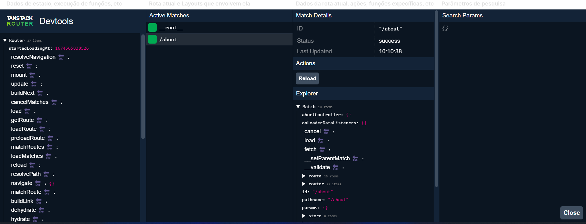

<p align="center">
  <a href="https://github.com/he4rt/4noobs" target="_blank" title="Clique para visualizar mais informações sobre o projeto 4noobs">
    
  </a>
</p>

# TanStack Router - DevTools

> 🔥 **Tá com pressa?** Se liga no sumário:
> 1. [O que é](#o-que-é-um-devtools)  
> 2. [Instalação](#como-instalar-o-tanstack-devtools)
> 3. [Criando a instância do DevTools](#criando-a-instância-do-devtools)  
> 3. [Utilizando o DevTools na aplicação](#utilizando-o-devtools-na-aplicação)  

## O que é um DevTools

O DevTools é um conjunto de ferramentas de desenvolvimento, os de navegadores web são um ótimo exemplo e são um dos tipos de DevTools mais conhecidos, permitindo aos desenvolvedores inpecionar, depurar e modificar o código de uma página web em tempo real. O DevTools é uma ferramenta valiosa para desenvolvedores para testar e otimizar seus sites e aplicações.

No contexto do **TanStack DevTools**, as ferramentas disponibilizadas são para auxiliar a visualização de todo o funcionamento interno do **TanStack Router** e evitar a perda de inúmeras horas tentando depurar uma aplicação com diversas rotas.

## Como instalar o TanStack DevTools

Para instalar o **TanStack DevTools** em sua aplicação, basta utilizar algum dos comandos abaixo de acordo com o seu gerenciador de pacotes:

```BASH
# Utilizando npm
npm install @tanstack/react-router-devtools@beta --save
# Utilizando Yarn
yarn add @tanstack/react-router-devtools@beta
# Utilizando pnpm
pnpm add @tanstack/react-router-devtools@beta
```

## Criando a instância do DevTools

Para utilizar as ferramentas do DevTools apenas em ambiênte de desenvolvimento, basta importá-lo da forma a seguir:


> ⚠️ Mas tome cuidado, é necessário que você defina a variável de ambiente `NODE_ENV` para identificar se a aplicação está sendo executada em produção.

```TSX
// ARQUIVO: router.ts

// Importação do lazy do react
import { lazy } from 'react';

const isRunningInProduction = process.env.NODE_ENV === 'production';
export const TanStackRouterDevtools =
  isRunningInProduction
    ? () => null // Não renderiza nada em produção
    : lazy(() =>
        // Lazy load em desenvolvimento
        import('@tanstack/react-router-devtools').then(
          (res) => ({
            default: res.TanStackRouterDevtools
          })
        ),
      );
```

## Utilizando o DevTools na aplicação

Lembra de quando foi introduzido o conceito de Layouts? Pois bem, para utilização do DevTools é necessário que você importe a instância dentro de um Layout, para que assim ele obtenha o **TanStack Router** automáticamente.

```TSX
// ARQUIVO: layouts/RootLayout.tsx

// Importação do DevTools
import { TanStackRouterDevtools } from '../router';

export function RootLayout() {
  return (
    <>
      <header>
        <Link to="/">Página inicial</Link> <Link to="/about">Sobre nós</Link>
      </header>
      <hr />
      <Outlet />
      <TanStackRouterDevtools
         position="bottom-right" {/* Altera a posição é exibido o botão do DevTools */}
      />
    </>
  )
}
```

E pronto! O botão para acionar o DevTools será exibido na aplicação na posição que você informou, tendo uma aparência parecida com essa:


Ao clicar sobre esse botão, uma tela de inspeção irá aparecer, nela é possível obter informações sober os layouts que a rota está contida, estados passados para a rota, histórico de navegação, execução de funções para navegação, parâmetros de pesquisa, erros, dentre muitas outras funcionalidades :)




<p align="center">Made with 💜</p>

<p align="center">
  <a href="https://github.com/he4rt/4noobs" target="_blank">
    
  </a>
</p>
